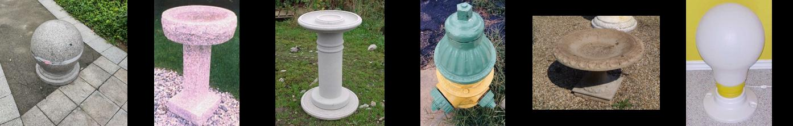

# dinov2-retrieval
A program of image retrieval using dinov2

Some random results(left: query image, others: retrieved image from [Caltech 256](https://data.caltech.edu/records/nyy15-4j048)):





## How to install
```bash
pip install dinov2_retrieval
```
Tested on:
+ MacOS 13.4
+ Windows 11
+ Ubuntu 20.04

## How to use

All available options:
```bash
$ dinov2_retrieval -h
usage: dinov2_retrieval [-h] [-s {small,base,large,largest}] [-p MODEL_PATH] [-o OUTPUT_ROOT] -q QUERY -d DATABASE [-n NUM] [--size SIZE]
                        [-m {0,5,10,15,20,25,30,35,40,45,50,55,60,65,70,75,80,85,90,95,100}] [--disable-cache] [-v]

optional arguments:
  -h, --help            show this help message and exit
  -s {small,base,large,largest}, --model-size {small,base,large,largest}
                        DinoV2 model type
  -p MODEL_PATH, --model-path MODEL_PATH
                        path to dinov2 model, useful when github is unavailable
  -o OUTPUT_ROOT, --output-root OUTPUT_ROOT
                        root folder to save output results
  -q QUERY, --query QUERY
                        path to a query image file or image folder
  -d DATABASE, --database DATABASE
                        path to the database image file or image folder
  -n NUM, --num NUM     How many images to show in retrieval results
  --size SIZE           image output size
  -m {0,5,10,15,20,25,30,35,40,45,50,55,60,65,70,75,80,85,90,95,100}, --margin {0,5,10,15,20,25,30,35,40,45,50,55,60,65,70,75,80,85,90,95,100}
                        margin size (in pixel) between concatenated images
  --disable-cache       don't cache database features, will extract features each time, quite time-consuming for large database
  -v, --verbose         show detailed logs
```

Generally, You only need to set `-q` (or `--query`) and `-d` (or `--database`) to run this program:
```bash
dinov2_retrieval -q /path/to/query/image -d /path/to/database
```
NOTE: both of them can be path to an image or a folder.

The results will be saved to `output` folder.

### Debug info
add `-v` or `--verbose` to show debug info

### Change model size
DINOv2 contains 4 types of pretrained models, you can use `--model_size` + one of [small, base, large, largest] to choose which model to use.

### Use cached model
If the network to GitHub (where the DINOv2 models are stored) is unstable, you can set `--model-path` to cached model folder after downloading model during the first run.


## TODO
+ [ ]. optimize visualization result, e.g., better background color
+ [ ]. More tech details

## License
MIT
